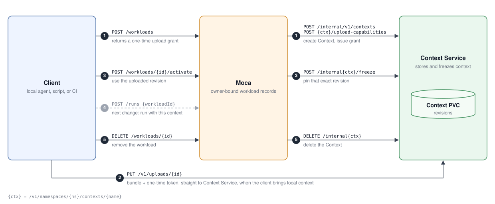

# Context Service and workloads

A Moca workload is a user's private environment for delegated tasks: where those tasks run and the
context they work from. Only the user who creates it can use it.

In this first phase, a workload provides only the context. Its files live in a Context stored by
[Context Service](https://github.com/rossoctl/context-service), which accepts uploads and freezes
revisions through a trusted API
([rossoctl/context-service#52](https://github.com/rossoctl/context-service/pull/52)). Moca keeps
the workload record. The tasks themselves run on the operator's shared, statically provisioned
sandboxes. A later phase gives each workload its own sandboxes and, optionally, a durable PVC
([#476](https://github.com/rossoctl/moca/issues/476)).

The client talks to Moca for the workload's lifecycle and sends the context bytes straight to
Context Service:



1. **Create:** `POST /workloads` creates the workload and its Context, and returns a one-time upload
   grant.
2. **Upload:** when the client brings local context, it sends the bundle straight to Context Service
   with that grant. Moca never handles the bytes.
3. **Activate:** `POST /workloads/{id}/activate` names the uploaded revision; Context Service freezes
   it.
4. **Run:** `/runs` with a `workloadId` arrives in a follow-up change and answers
   `501 workload_runs_unavailable` until then.
5. **Delete:** `DELETE /workloads/{id}` deletes the Context, then the workload.

The routes are off by default. With them off, every `/workloads` route answers
`501 workloads_unavailable`.

## Routes

Every route takes the user's control-plane API token (`Authorization: Bearer`, scope `api`), even
when `SH_REQUIRE_AUTH` is off. A missing token is `401 token_required`; a session token or a bad
token is `401 token_invalid`.

| Route                                            | Success                            | Errors                                                          |
| ------------------------------------------------ | ---------------------------------- | --------------------------------------------------------------- |
| `POST /workloads`                                | `201` workload plus `upload` grant | `400`, `409 workload_name_taken`, `429 workload_quota_exceeded` |
| `POST /workloads/{name}/uploads`                 | `201` a fresh grant                | `404`, `409 workload_not_awaiting_upload`                       |
| `POST /workloads/{name}/activate` `{"revision"}` | `200` workload, status `ready`     | `400 revision_invalid`, `404`, `409`                            |
| `GET /workloads/{name}`                          | `200` workload                     | `404`                                                           |
| `DELETE /workloads/{name}`                       | `204`                              | `404`, `409`                                                    |

`POST /workloads` takes `name` (a lowercase Kubernetes name of at most 50 characters; generated if
omitted), `contextType` (`workspace`, the default, `state`, `memory`, `knowledge` or `artifacts`)
and `workspace` (`size` in `Mi` or `Gi`, default `1Gi`, and an optional `storageClass`). Other
fields are refused. Moca creates the Context and returns a one-time grant: the client PUTs its
bundle to `upload.uploadUrl` with `upload.token`. Moca never handles bundle bytes. The grant
expires after five minutes; `POST .../uploads` issues another while the workload awaits upload.

`POST .../activate` names the revision that the upload returned. Context Service freezes it and the
workload becomes `ready`. Context Service's `409` codes pass through, for example
`revision_mismatch` when that revision is not the one uploaded. Repeating an activation with the
same revision is a no-op.

`DELETE` deletes the Context, then marks the workload `deleted` and frees its name and quota. If
Context Service fails, the workload stays `deleting` and a repeated `DELETE` retries.

A request that loses a race with another lifecycle request, such as an activation racing a delete,
answers `409 workload_state_changed` and changes nothing. Context Service failures answer
`502 context_service_error`.

## Names are per user

Each user has their own names: two users can each own `demo`. Another user's workload is
indistinguishable from a missing one (`404 workload_not_found`, never `409`). This is the first half
of [rossoctl/moca#358](https://github.com/rossoctl/moca/issues/358) (per-user PVC authorization).

The Context's name in Context Service is derived from the owner, the workload name and that
reservation, so it is unique per user and per re-creation and does not reveal the owner. Moca never
returns it, nor the Context's identity. Context Service records the user (`user:<subject>`) as the
Context's owner.

## Settings

| Variable                               | Meaning                                                             |
| -------------------------------------- | ------------------------------------------------------------------- |
| `MOCA_CONTEXT_WORKLOADS_ENABLED`       | `1` turns the routes on, together with `CONTEXT_SERVICE_URL`        |
| `CONTEXT_SERVICE_URL`                  | Internal base URL of Context Service                                |
| `CONTEXT_SERVICE_TOKEN`                | Bearer Context Service accepts for its trusted routes               |
| `CONTEXT_SERVICE_PUBLIC_URL`           | Base URL clients upload to; HTTPS, or HTTP on loopback only         |
| `CONTEXT_SERVICE_NAMESPACE`            | Context namespace; defaults to `POD_NAMESPACE`, then `default`      |
| `CONTEXT_SERVICE_TIMEOUT_MS`           | Per-request timeout, default `5000`                                 |
| `MOCA_CONTEXT_MAX_WORKLOADS_PER_OWNER` | Live workloads per user, default `5`                                |
| `MOCA_CONTEXT_MAX_STORAGE_GIB`         | Largest `workspace.size`, default `10`                              |
| `MOCA_CONTEXT_STORAGE_CLASSES`         | Comma-separated StorageClasses a caller may name; empty allows none |
| `MOCA_WORKLOAD_DELETED_TTL_SECONDS`    | How long `GET` still reports a deleted workload, default `86400`    |

A missing token or an unsafe public URL answers `500 workloads_misconfigured`.

On Kubernetes, `deploy/k8s` reads these from an optional `moca-context-service` ConfigMap (keys
`enabled`, `url`, `public-url`, `namespace`) and Secret (key `token`), and allows the supervisor to
reach pods labelled `app.kubernetes.io/name: context-service` on port 8080 in the `context-service`
namespace:

```bash
kubectl -n moca create configmap moca-context-service \
  --from-literal=enabled=1 \
  --from-literal=url=http://context-service.context-service.svc:8080 \
  --from-literal=public-url=https://context.example.com
kubectl -n moca create secret generic moca-context-service --from-literal=token="$CS_TOKEN"
kubectl -n moca rollout restart deployment/moca-supervisor
```
