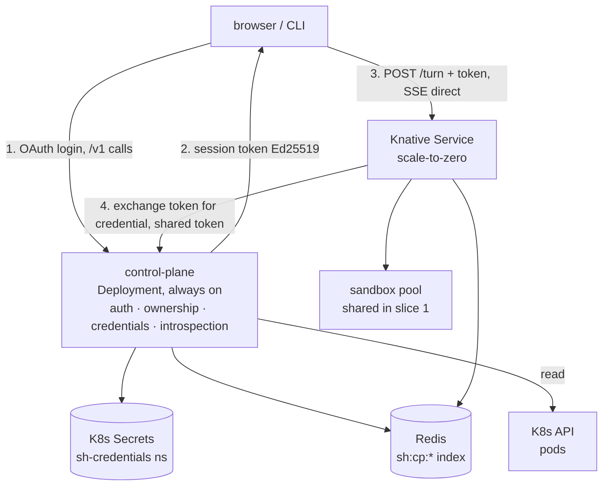

# MU1 — Multi-User Control Plane: authenticated API, owned sessions, per-user credentials

Version: 1.0 — September 8, 2026
Status: Proposed
Scope: Turn the harness from a single-tenant deployment into a **multi-user service**. Introduces an
always-on **control plane** that owns the authenticated API surface (`/v1`), the session-ownership
index, and a per-user credential store; and makes the data plane carry a **per-request subject**
instead of an ambient deployment credential.
Milestone: **MU1**, first entry in the new **`MU` (multi-user service)** track — not a Phase-2 `Z` id,
because Phase 2 is a security architecture and this is a product surface. Source of truth for
numbering: [Milestone Registry](README.md).
Builds on (reuse, no redesign): [Z1](2026-06-26-identity-spine-design.md) trust tiers and the
`CredentialInjector` shape; [Z2](2026-06-26-harness-lockdown-design.md) secret-free container;
[Z3](2026-06-26-inference-injector-design.md) "the harness holds no provider key";
[Z5](2026-06-19-m13-generalized-credentialed-egress-design.md) per-user egress;
[RC1](2026-07-10-authbridge-egress-control-plane-poc-design.md) placeholder swap;
[Glossary](../glossary.md) canonical `session`/`turn` vocabulary.
Composes with: **P5** multi-session isolation ([`2026-09-06-p5-session-isolation-design.md`](2026-09-06-p5-session-isolation-design.md),
[ADR-0032](../adrs/0032-per-request-subject-no-ambient-credential.md)) — **design merged** in
[#228](https://github.com/rossoctl/moca/pull/228), implementation on a separate
contributor's track. P5 reserved `Authorization` for caller auth, which is exactly this spec; §3.5–§3.6
set the split, what MU1 does before P5 lands, and the three interactions MU1 carries.
Decision record: [ADR-0033](../adrs/0033-multi-user-control-plane.md).

> **The one-sentence thesis.** Multi-user reduces to one property — _a request's upstream identity is
> determined solely by that request_ — and the cheapest way to make that property enforceable rather
> than hoped-for is to move both the identity and the credential out of the model-influenced pod and
> into a trusted tier that hands them back per turn.

---

## 1. Goal & scope

### Goal

Let many users share one deployment such that each can authenticate, hold their own credentials, run
sessions on their own identity, and see and delete only their own work — with the isolation resting
on properties the process cannot violate rather than on care.

### In scope

- The **control-plane tier**: an always-on service owning auth, the ownership index, the credential
  store, and resource introspection — §3.
- The **`/v1` API contract**, delivered as a checked-in OpenAPI 3.1 document — §4.
- **Identity**: GitHub OAuth login, and an Ed25519 **session token** that carries subject and session
  without carrying a secret — §5.
- The **credential model**: an open, destination-bound registry keyed by consumer tier, stored as
  per-user Kubernetes Secrets under envelope encryption — §6.
- **Data model**, cascade delete, and the `/resources` projection — §7.
- **Per-subject credential inflow** on the `/turn` path: the subject derived from the session token
  (never an inbound header), and that subject's credential installed as the model's per-turn `Bearer`
  header — §3.4, §3.5, §6.4.

### Out of scope (later slices, named honestly)

- **Sandbox pool tenancy.** Slice 1 ships with a **shared** pool: two users' leaves can be placed on
  the same pod. Isolation in slice 1 holds at the API, the session store, and the inference
  credential — **not** the sandbox. §8.2 states the partition design; §10 schedules it as **MU2**.
- **Leaf and CLI credential paths** stay ambient (`leaf-job.ts:15-18`, `harness/src/cli.ts:9-14`).
- **Delivery of `sandbox-egress` credentials.** Slice 1 stores them; nothing consumes them, because
  delivery means writing a secret into the untrusted tier — Z5's problem, not this spec's.
- **Quotas and cost attribution**, generic OIDC, owned `/v1/schedules` and `/v1/runs` — **MU2**.
- **Injector-resolved credentials** (Z3/Z5), which retire this spec's interim trust assumption — **MU3**.
- **Vault / External Secrets** as the credential backend — the stated future direction (§6.6), behind
  the `CredentialStore` interface from day one.

---

## 2. Current state — verified, with citations

Traced in the tree at `b533d87`, not inferred; re-verified at `1deacac` after P5 merged, which
changed no code and so shifted no line number.

### 2.1 There is no principal anywhere

The data plane's routes (`packages/knative-server/src/server.ts:495-575`) are `GET /health`,
`POST /workloads`, `GET|DELETE /workloads/{name}`, `POST /runs` (+ `/runs/status`), and `POST /turn`.
None reads an `Authorization` header. Nothing in the request path names a user.

### 2.2 One ambient credential serves every caller

`buildConfig()` (`server.ts:66-73`) takes **no arguments** and reads `process.env.ANTHROPIC_AUTH_TOKEN`
(`:71`) and `ANTHROPIC_BASE_URL` (`:70`). It is called at `:111` (sync turn), `:174` (async dispatch),
and `:411`/`:415` (leaf). `leaf-job.ts:15-18` and `harness/src/cli.ts:9-14` do the same.

Inside the turn there are **three** environment reads on the credential path, not one:

| Location              | Code                                                                                         | Effect                                                                                         |
| --------------------- | -------------------------------------------------------------------------------------------- | ---------------------------------------------------------------------------------------------- |
| `run-turn.ts:306`     | `config?.anthropicAuthToken \|\| process.env.ANTHROPIC_AUTH_TOKEN`                           | an absent explicit value silently falls back to the deployment's                               |
| `run-turn.ts:310-312` | `if (authToken && !process.env.ANTHROPIC_API_KEY) process.env.ANTHROPIC_API_KEY = authToken` | write-once-**if-absent**: session A's token sticks process-wide, so B..N authenticate **as A** |
| `run-turn.ts:313`     | `config?.anthropicBaseUrl \|\| process.env.ANTHROPIC_BASE_URL`                               | same fallback for the gateway base                                                             |

The middle row is the cross-tenant identity leak P5 §2.1 identified. All three must go for the `/turn`
path to fail closed **by construction**, and removing only the seed leaves the `||` fallbacks intact —
but those deletions are **P5's**, not MU1's, and §3.4 explains why MU1 touches none of them.

### 2.3 The session store has no owner, and its list is unusable for users

`LogStore` (`packages/session-backend/src/backend.ts`) exposes `list(): Promise<string[]>` — "all known
session ids", with no owner concept. `RedisSessionBackend.list()` implements it as
`client.keys('session:*')` filtered by suffix (`redis-backend.ts:80-84`). Keys are `session:<sid>` and
`session:<sid>:seq` (`:6-7`). So requirement "list my sessions" has neither the data nor a usable
access path today, and the control plane must never route a user-facing list through `keys()`.

### 2.4 There is no session → sandbox reverse index

Leases live in `sh:sandbox:<pod>:leases` — a ZSET whose **member is the run id, not the session id**,
score = expiry ms (`harness/src/sandbox-lease.ts:3-6`, `ACQUIRE_LUA` `ARGV[3]`). Presence records are a
hash at `sh:sandbox:records` (`pool-records.ts:17-20`). Answering "which sandbox is my session on"
therefore requires scanning every pod's ZSET — O(pods) per request, and racy. §7.4 resolves this.

### 2.5 Redis is entirely ephemeral

`deploy/knative/redis.yaml` is a single-replica `redis:7-alpine` Deployment: **no PVC, no volume, no
`appendonly`**, 128Mi memory limit. Everything in Redis dies with the pod. This decides the credential
store (§6.5).

### 2.6 A pool-selector seam already exists — and already declines the prompt path

`POST /runs` deletes any client-supplied `sandboxPoolSelector` (`server.ts:553`), commenting that "a
workload resolver may add one after this boundary." `resolveRunWorkload()` (`:300-324`) is that
resolver: it returns `{ ...body, sandboxPoolSelector: record.sandboxSelector }` from a
`WorkloadRecord.sandboxSelector` (`context-service.ts:13-26`).

**But for `kind: 'prompt'` it deliberately ignores the workload's selector and only warns** (`:308-320`,
an ADR-0028 amendment): _"Whether a workload's pool should bound its prompt leaves is a separate
decision … until it is taken, warn rather than change behavior here."_ A per-user session turn is
exactly that case, so §8.2's tenant partition inherits an already-deferred decision rather than
inventing one. §11.1 records it as owed; tracked as
[#237](https://github.com/rossoctl/moca/issues/237).

### 2.7 Pi does not need changing

P5 §2.2 traced this and it still holds: `AgentSession` resolves auth per request via
`_getRequiredRequestAuth` from a **per-instance** `ModelRegistry`, passes the resolved key explicitly
into stream options, and `withEnvApiKey` consults the environment **only when no explicit key was
given**. The environment is a fallback _beneath_ an already-per-session mechanism. Nothing in
`pi-fork` changes.

---

## 3. Architecture

### 3.1 Components



The **control plane** is a plain `Deployment`, deliberately not Knative: it holds a JWKS/OAuth client,
mints tokens for cron-fired runs with no client present, and is the trusted tier. Scale-to-zero would
buy nothing and cost a cold start on every `GET /v1/sessions`.

The **data plane** stays the same deployable and image. It gains a session-token verifier and a
subject-carrying `buildConfig()`.

### 3.2 Trust tiers

Per [Z1](2026-06-26-identity-spine-design.md) §2:

| Tier    | Component         | Trust                           | Mints identity? | Holds secrets?        |
| ------- | ----------------- | ------------------------------- | --------------- | --------------------- |
| Control | **control plane** | trusted; not model-influenced   | yes (sole)      | **yes — see §3.3**    |
| Brain   | harness           | semi-trusted (untrusted _data_) | no              | transiently, per turn |
| Hands   | sandbox           | untrusted (model code)          | no              | no                    |

### 3.3 The accepted divergence from Z1

Z1 §2's table gives the orchestrator **"Holds secrets? no"**, specifically to keep the identity crown
jewel out of the credential blast radius. This design puts both in one component: the control plane
mints session identity **and** holds the credential store.

That is a real concentration of risk, accepted for one reason: the alternative — per-subject
resolution at the inference injector — lives in `rossoctl/cortex` (formerly `kagenti-extensions`),
outside this repo, and would
block every user-visible deliverable on another codebase. Two containments make the cost bounded:

- A `CredentialStore` interface (§6.6), so slice 3 moves resolution behind the Z3/Z5 injector without
  reshaping a handler or an endpoint.
- Credential Secrets in a **separate namespace** with **no `list` verb** granted to the serving path
  (§6.5), so "read the credential store" and "read any Secret in the app namespace" are not the same
  permission, and a compromised control plane cannot enumerate users.

Recorded in [ADR-0033](../adrs/0033-multi-user-control-plane.md). Retired by slice 3.

### 3.4 How the per-subject credential actually reaches the model

The first draft of this section said "pass the key as an explicit argument, and pi's per-session
`apiKey` does the rest." Reading P5's merged §3.3 and the code it cites shows that is **not the
mechanism available**, so it is corrected here.

`createAgentSession` (`run-turn.ts:499-504`) exposes **no seam** to pass a per-session key into the
session's `ModelRegistry`. Pi resolves the request key **by provider name** —
`authStorage.getApiKey('anthropic')` → `getEnvApiKey('anthropic')` → `process.env.ANTHROPIC_API_KEY`
(documented at `run-turn.ts:150-155`) — so with that variable absent, `_getRequiredRequestAuth`
throws `No API key found for "anthropic"` before any request is attempted.

What _is_ per-session is the **model object**, rebuilt every turn at `run-turn.ts:497` by
`applyModelGateway` (`:294`), which installs `Authorization: Bearer <token>` from
`config.anthropicAuthToken` and prefers `config` over the environment at `:306`. So the credential
path MU1 uses is:

```
control plane ──exchange──▶ TurnConfig.anthropicAuthToken
                              │
                              ▼  applyModelGateway (per turn)
                        model.headers.Authorization = Bearer <subject's token>
                        ANTHROPIC_API_KEY = P5's inert sentinel   ← satisfies pi's existence check
                        ANTHROPIC_OAUTH_TOKEN deleted            ← or it would outrank the sentinel
```

Two consequences follow, and they are the reason §3.5 changed:

- **MU1 does not need to touch `run-turn.ts` at all.** `:306` already prefers `config` over the
  environment. MU1's work is to make `config` carry the _right subject's_ token — which is
  `server.ts` and the control plane, not the gateway function.
- **Deleting the `:310-312` seed is not MU1's to do, and must not be done without P5's sentinel.**
  Delete it alone and `ANTHROPIC_API_KEY` goes absent, so gateway mode breaks outright (P5 §3.3).
  P5's step 3 replaces it with a fixed non-secret sentinel; MU1 consumes that, and duplicating it
  would be both redundant and a merge conflict. Note the sentinel is only what pi resolves if
  `ANTHROPIC_OAUTH_TOKEN` is **absent** — `getApiKeyEnvVars('anthropic')` returns
  `["ANTHROPIC_OAUTH_TOKEN", "ANTHROPIC_API_KEY"]` in that order, OAuth first — which is why P5's
  step 3 **deletes** it rather than only overwriting `ANTHROPIC_API_KEY`, and why §9.3 test 1 asserts
  the absence and not just the sentinel.

### 3.5 Composition with P5 — and what MU1 does before it lands

P5's design is **merged** ([ADR-0032](../adrs/0032-per-request-subject-no-ambient-credential.md), via
[#228](https://github.com/rossoctl/moca/pull/228)); its **implementation** is a separate
contributor's track on a different timeline. The two specs turn out to be complementary by
construction, because P5 §3.2 step 1 reserved `Authorization` for precisely this spec:

> `Authorization` is unused on inbound requests today … but its meaning there is "may this caller use
> the harness" — and ADR-0011's lock-down implies caller auth is coming. Overloading one header with
> _authorize the caller_ and _whose budget to spend upstream_ collides exactly when that lands.

So the header split is already decided, and MU1 adopts it unchanged:

| Header                                  | Means                             | Owner          |
| --------------------------------------- | --------------------------------- | -------------- |
| `Authorization: Bearer <session token>` | _may this caller use the harness_ | **MU1** (§5.2) |
| `X-SH-Subject`                          | _whose work this is_              | **P5**         |

**MU1's contribution is making the subject trustworthy rather than asserted.** P5 reads
`X-SH-Subject` from the inbound request, which is correct for a trusted orchestrator but is exactly
the spoofable-header pattern [Z1](2026-06-26-identity-spine-design.md) §3.2 warns about once
arbitrary users can call the API. Therefore:

> **When a session token is present, the subject is `token.sub`, and any inbound `X-SH-Subject` is
> ignored.** A request carrying both a session token and a conflicting `X-SH-Subject` is rejected
> with `subject_conflict` (400) rather than resolved by precedence — a silent winner here is a
> cross-tenant bug waiting to be written.

The operator-driven and leaf paths keep P5's inbound-header behaviour; they are not user-facing.

#### Ownership split

| Concern                                                                                        | Owner                                     |
| ---------------------------------------------------------------------------------------------- | ----------------------------------------- |
| `Authorization` caller auth; subject derived from the token; per-subject credential resolution | **MU1**                                   |
| `buildConfig(req)` signature and per-request subject inflow                                    | **P5** (MU1 extends it to read the token) |
| Removing the `:306`/`:313` fallbacks and the `:310-312` seed                                   | **P5**                                    |
| The startup sentinel + deleting `ANTHROPIC_OAUTH_TOKEN` / `ANTHROPIC_AUTH_TOKEN`               | **P5**                                    |
| Reachability pins for the four inert globals                                                   | **P5**                                    |
| Leaf `ScaledJob` and CLI paths                                                                 | **P5**                                    |

#### If P5's implementation has not landed

MU1 still ships, with a weaker but honestly-stated property. Because `:306` already prefers `config`,
a subject's token reaches the model correctly today; what is missing without P5 is the _guarantee_
that nothing ambient can substitute for it. So MU1 enforces fail-closed **by policy at two points it
owns** — `POST /v1/sessions` refuses a subject with no resolvable credential, and the exchange refuses
to return one — while the process-level guarantee waits on P5's step 3.

The distinction matters and the spec will not blur it: with P5, a credential-less session **cannot**
run on a neighbour's identity; without P5, it _does not_, because two checks say so. §8.1 records
which of the two is in force, and §9.3 test 1 is written to assert the policy version today and
tighten to the process version once the sentinel exists.

### 3.6 What MU1 owes P5's implementation

P5's design is merged and should not be rewritten to accommodate a later spec, so the three
interactions between them are carried here.

#### 1. The `Bearer` payload is one-or-the-other

|                 | What rides in `Authorization: Bearer …`                                                                                                                                |
| --------------- | ---------------------------------------------------------------------------------------------------------------------------------------------------------------------- |
| **P5 target**   | an **inert placeholder** derived from the subject; RC1's `static-inject` rewrites `Bearer <placeholder>` → `Bearer <real>` from a mounted `secret_dir` (P5 §3.1, §3.2) |
| **MU1 interim** | the **real token** resolved by the control plane; no injector in the path                                                                                              |

Same field, incompatible contents. Left implicit, a P5 implementation that unconditionally sets the
placeholder would silently overwrite MU1's token, and requests would fail with no injector configured
to swap it. So `TurnConfig` carries a **tagged** credential, not a bare string:

```ts
type UpstreamCredential =
  | { mode: 'placeholder'; value: string } // P5 + an injector in the egress path
  | { mode: 'direct'; value: string }; // MU1 interim, control-plane resolved
```

**Resolution rule: the control plane declares the mode at exchange time, and placeholder mode wins
whenever the deployment has an injector.** Direct mode is reachable only when none is configured, so
adding an injector strictly _narrows_ what the harness may hold, and MU3 deletes direct mode outright.

The tag is not ceremony. A bare string makes the two modes indistinguishable, and both failure
directions are silent: a placeholder-mode deployment with a misconfigured injector sends the
placeholder upstream and gets an opaque auth error, while a direct-mode deployment that later grows an
injector has its real key rewritten. P5 §3.4 argues that an ambient _placeholder_ is as dangerous as
an ambient key, because the injector faithfully swaps in whichever tenant's credential it names — and
that argument applies with equal force to a **mislabelled** one. The tag makes the mode assertable
instead of inferred.

#### 2. Direct mode diverges from P5 §5's in-process invariant

P5 §5 asserts that after the startup scrub, **no real provider credential is reachable from the
harness process** in server mode. Direct mode puts one there every turn.
[ADR-0033](../adrs/0033-multi-user-control-plane.md) accepts that cost, and it is named here as a
divergence from **P5 §5** as well as from Z1 §2 / Z3 — so that P5's implementation does not assert an
invariant MU1 knowingly breaks.

Concretely, the environment is not out of reach either — it is written, by **P5's own construct, not
MU1's**. The write-once-if-absent seed at `run-turn.ts:336-338` — guarded by
`if (authToken && !process.env.ANTHROPIC_API_KEY)` — is unchanged by this spec, and MU1 was
deliberately forbidden from touching it (§3.5's ownership split). Since MU1, the resolved token is
`config?.upstreamCredential?.value` first (`:329-332`), so in direct mode the first authenticated turn
in a fresh harness pod with no `ANTHROPIC_API_KEY` set writes **that subject's real provider key**
into the process environment for the pod's lifetime, spanning every other user's subsequent turns.
`harness/test/model-gateway.test.ts` now pins exactly this, asserting `process.env.ANTHROPIC_API_KEY`
becomes the direct-mode credential value, so the claim is anchored to something executable rather than
to prose.

Reachability stays narrow: `service.yaml:45-49` makes `ANTHROPIC_API_KEY` a **required**
`secretKeyRef`, so a normally-deployed pod always has it set and the guard never fires — this is not a
routine leak. The net effect is that the divergence declared above is slightly wider than this section
first said, not that MU1 introduces a second one: the seed is P5's, and removing it without P5's
sentinel remains P5's to do, not MU1's. MU3 removes the divergence by removing direct mode.

#### 3. Inbound `X-SH-Subject` becomes conditional

Per §3.5, once a session token is present the subject is `token.sub` and an inbound `X-SH-Subject` is
ignored. P5's implementation should therefore **not** pin "inbound `X-SH-Subject` is always honoured":
the operator and leaf paths keep that behaviour, the token-bearing path does not.

---

## 4. API contract

Delivered as **`docs/api/openapi.yaml`** (OpenAPI 3.1), pinned by a contract-drift test (§9, test 3).

### 4.1 Two conventions

**The principal is never in a path.** `/v1/sessions` means _my_ sessions, derived from the token. Admin
listing is `?owner=<subject>`, gated on a role claim. Subject-in-path makes every future authz rule a
string comparison against a URL segment, and makes token and path two sources of truth for one fact.

**The data plane gains `/v1` aliases, not a hard break.** Reuse the alias machinery already at
`server.ts:482-494`, which is mid-migration on `/run-leaf → /runs`. Forcing a second simultaneous
version break on `/turn` would run two migrations at once against live orchestrators.

### 4.2 Control plane (`@moca/control-plane`)

| Route                             | Slice | Notes                                                                                                    |
| --------------------------------- | ----- | -------------------------------------------------------------------------------------------------------- |
| `GET /v1/me`                      | 1     | subject, display name, roles                                                                             |
| `POST /v1/sessions`               | 1     | creates the ownership record → `{sessionId, token, expiresAt}`; resolves the inference credential (§6.4) |
| `GET /v1/sessions`                | 1     | owner-filtered, paged from the owner zset; `?owner=` requires `role=admin`                               |
| `GET /v1/sessions/{id}`           | 1     | owner, timestamps, state, turn count                                                                     |
| `DELETE /v1/sessions/{id}`        | 1     | cascade — §7.3                                                                                           |
| `GET /v1/sessions/{id}/resources` | 1     | §7.4                                                                                                     |
| `POST /v1/sessions/{id}/token`    | 1     | re-mint; a session outlives a 5-minute token                                                             |
| `GET /v1/credentials`             | 1     | **metadata only — no value is ever returned**                                                            |
| `PUT /v1/credentials/{name}`      | 1     | write-only; no read-back path exists                                                                     |
| `DELETE /v1/credentials/{name}`   | 1     |                                                                                                          |
| `POST\|GET\|DELETE /v1/schedules` | 2     | owner recorded at creation (§5.5)                                                                        |
| `POST /v1/runs`                   | 2     | user-owned async dispatch                                                                                |
| `GET /healthz`, `/readyz`         | 1     |                                                                                                          |
| `POST /internal/credentials`      | 1     | data plane only, `SH_EXCHANGE_TOKEN` — §5.3.1                                                            |

### 4.3 Data plane (existing Knative Service)

| Route                           | Change                                                           |
| ------------------------------- | ---------------------------------------------------------------- |
| `POST /v1/turn` (alias `/turn`) | requires a session token; subject and credential derived from it |
| `POST /v1/runs` (alias `/runs`) | unchanged — operator-authenticated, orchestrator-facing          |
| `POST\|GET\|DELETE /workloads`  | unchanged                                                        |
| `GET /health`                   | unchanged                                                        |

`POST /turn` enforces exactly one rule: **`token.sid === body.sessionId`**. It performs no ownership
lookup — it holds no ownership data and should not.

#### 4.3.1 Rollout: `SH_REQUIRE_AUTH`, default off

"Requires a session token" cannot mean "always", because **14 scripts in `deploy/knative/` call
`/turn` or `/runs` with no auth today** — including `setup-kind.sh`, `setup-ocp.sh`, `smoke.sh`,
`leaf-smoke.sh`, `leaf-async-smoke.sh`, `leaf-gate-smoke.sh`, `turn-stream-smoke.sh`, `lib.sh`,
`e6-saturation.sh`, and both demos. Making the token mandatory in one step breaks every smoke path
and both demos simultaneously, which is the kind of change that gets reverted rather than fixed.

So the data plane reads **`SH_REQUIRE_AUTH`**, defaulting to **`false`**:

| `SH_REQUIRE_AUTH` | No token                                      | Valid token                         | Invalid/expired token               |
| ----------------- | --------------------------------------------- | ----------------------------------- | ----------------------------------- |
| `false` (default) | proceeds exactly as today, ambient credential | subject + credential from the token | **401** — never silently downgraded |
| `true`            | **401** `token_required`                      | subject + credential from the token | **401**                             |

Two properties this table is shaped to guarantee:

- **A present-but-bad token always fails**, in either mode. The flag governs whether auth is
  _required_, never whether it is _enforced_ — "unauthenticated is allowed here" and "this bad token
  is close enough" are different statements, and only the first is a deployment choice.
- **The multi-user demo runs with `SH_REQUIRE_AUTH=true`**, so the property being demonstrated is the
  real one, not the permissive default.

Existing scripts are untouched by MU1. Flipping the default to `true` — and updating those 14 callers
to obtain a token — is **MU2**, once the control plane is deployed by default rather than opt-in.

---

## 5. Identity and the session token

### 5.1 GitHub is not an OIDC provider

Worth stating because it changes the implementation: GitHub's **user-login** flow is plain OAuth 2.0.
There is no `id_token`, no discovery document, no JWKS. A code is exchanged for an **opaque** token and
identity comes from `GET https://api.github.com/user`. (GitHub issues OIDC tokens only to Actions
workloads, not to logging-in humans.)

Behind an `IdentityProvider` seam:

- **Slice 1 — `github-oauth`**: code exchange → `/user`. The subject is **`github:<numeric id>`**, never
  the login, which is mutable and reusable after account deletion.
- **Slice 2 — `oidc`**: discovery + JWKS, for Keycloak/Dex/Entra/OCP cluster OAuth.

Rejected for slice 1: running Dex with a GitHub connector and writing only the generic verifier.
Cleaner long-term, but it adds a second new deployable to the demo path to defer code needed anyway.

#### 5.1.1 What the demo needs before it can run

`demo-multiuser.sh` is a shell script, so it cannot complete a browser redirect. GitHub's **OAuth
device flow** is the right fit and is what MU1 implements:

```
POST https://github.com/login/device/code        → { device_code, user_code, verification_uri }
   operator visits github.com/login/device, enters the code as Alice, then as Bob
POST https://github.com/login/oauth/access_token → poll until authorized
```

Prerequisites, which are **manual, one-time, and outside any script**:

- A registered GitHub **OAuth app** with **device flow enabled** (it is off by default).
- `SH_GITHUB_CLIENT_ID` set on the control plane. **No client secret is needed** — the device flow
  treats the app as a public client, which is also why this is safe to run from a script that a
  developer reads.
- Two GitHub accounts, to be Alice and Bob. The demo cannot fabricate two subjects, because the whole
  point is that the subject is attested by GitHub rather than asserted by the caller.

The browser **authorization-code** flow — which does need a client secret and a registered redirect
URI — is only required by a web UI, and is therefore **MU2**, alongside the generic `oidc` provider.

The demo script must skip with a clear message, not fail, when `SH_GITHUB_CLIENT_ID` is unset, in the
style of the existing env-gated live smokes.

### 5.2 The session token

A JWT signed with **Ed25519**; the private key is a control-plane Secret, and the data plane receives
only the **public** key.

The asymmetry is load-bearing, not stylistic. The harness is the brain tier — semi-trusted, processing
untrusted model output. Under a shared HMAC secret a compromised harness could **mint** a token for any
subject; under Ed25519 it can only verify. The trust tier dictates the algorithm.

```
iss, aud="harness", sub="github:1234", sid=<sessionId>,
tenant, scope=["turn:write"], exp=+5min, jti
```

**No credential travels in the token.** It is a capability naming a subject and a session.

**Key distribution and rotation.** The JWT header carries a **`kid`**, and the data plane reads
`SH_SESSION_TOKEN_PUBLIC_KEYS` — a comma-separated list of `<kid>:<base64 Ed25519 public key>`. A
public key is not a secret, so this is plain configuration on the Knative Service, not a Secret mount.

Accepting a _list_ is what makes rotation possible without a flag day: publish the new key alongside
the old, roll the Service, switch the control plane to signing with the new `kid`, then drop the old
entry. Tokens minted before the switch keep verifying for their five-minute lifetime.

A malformed or mislabelled entry — including the rotation footgun of publishing the new key under the
old `kid` — is refused at **parse** time, and both tiers parse before serving: the control plane in
`configFromEnv`, the data plane in `startServer`. Neither `/healthz` nor `/readyz` touches the keyset,
so without that boot check an operator typo would be a Ready pod that refuses every turn. The data plane
_also_ re-reads per request so a Knative env change needs no restart; that path converts the same
failure into a typed `credential_unavailable` (503) rather than returning the parse error's text to a
caller.

Deliberately **not** a JWKS endpoint on the control plane. Fetching keys at verify time would put a
control-plane round trip on the critical path of every turn and undo §9.2's property that an
identity-provider or control-plane outage does not break running work — verification stays local
arithmetic. The cost is that rotation is a config roll rather than automatic, which for a key that
rotates on the order of months is the right trade.

### 5.3 The credential exchange

At turn start the data plane exchanges the presented token for that subject's credential (authenticated
per §5.3.1):

```
harness ──POST /internal/credentials { token } ──▶ control plane
        ◀── { mode, anthropicAuthToken, anthropicBaseUrl }
```

`mode` tags the credential as `placeholder` or `direct` (§3.6). `anthropicBaseUrl` resolves from the
credential's `endpoint`, else the deployment default, else the exchange refuses with
`endpoint_unresolved` (§6.2) — it is never returned undefined, because `run-turn.ts:313` would then
fall through to the environment and, failing that, send the subject's token to the default endpoint
with no `baseUrl` override.

#### 5.3.1 How the harness authenticates to the exchange

`/internal/credentials` hands out real credentials, so it must not be callable by anything that can
merely reach the control plane's Service.

**MU1 reuses the pattern this repo already runs**: a shared bearer token from a Secret, fail-closed on
mismatch — exactly how the relay and remote worker authenticate to each other today
(`SH_RELAY_TOKEN` from the `sh-relay-token` Secret, `relay-deployment.yaml:45`,
`worker-deployment.yaml:35-43`). Here it is `SH_EXCHANGE_TOKEN`, mounted into both the control plane
and the Knative Service from one Secret; a request without it, or with the wrong value, gets **401**
and is not logged with the presented value.

Earlier drafts of this spec said "mTLS" in three places without saying where certificates come from.
On kind or on OCP without SPIRE that is a non-trivial build — cert issuance, rotation, and trust
distribution — for a hop that has exactly two participants, both operator-deployed, inside one
cluster. A shared token gets the same property (only the harness can call the exchange) at a fraction
of the cost, and it is a pattern already in the tree with a working precedent.

**mTLS remains the target, and Z1 is what makes it cheap.** Once per-session SPIFFE identities exist,
the exchange authorizes on the peer's SVID instead of a shared secret, and gains what a shared token
cannot give: the _caller_ is identified per session rather than per deployment. Until then, this hop's
weakness is that any code running in the harness pod can call the exchange — which is already true of
anything the harness can reach, and is why the exchange returns only the credential for the subject
named by a **signed** token it cannot mint (§5.2), not an arbitrary one.

If the credential rode inside the token, a client-visible bearer string would contain a provider key —
landing in browser storage, proxy logs, and shell history. This keeps it server-side and matches the
shape [Z1](2026-06-26-identity-spine-design.md) §4 defines for `CredentialInjector`.

The exchange also checks the session tombstone (§7.3), so a deleted session cannot start a new turn.

**This puts the control plane on the control path once per turn — never on the data path.** It sees no
prompt and no model output; the SSE stream stays direct from the Knative Service to the client.

### 5.4 Where authz is enforced

Every session-scoped control-plane handler goes through a single
`assertOwner(sessionId, principal)` that reads the ownership record and throws a typed `NotFound` on
mismatch. The failure mode designed against is authz scattered per-handler, where the fifth endpoint
someone adds forgets the check — hence one choke point plus an enumeration test (§9, test 2).

### 5.5 Offline execution

OIDC/OAuth authenticates **API calls**; the stored credential authorizes **egress**. The two are
decoupled, so a queued or cron-fired run needs no refresh token: the control plane mints a session
token for the owner recorded on the schedule and resolves that owner's stored credential.

Accepted cost: revoking the user at the identity provider does **not** stop their scheduled runs.
Stopping them requires deleting the schedule or the credential. §11 records storing an OIDC offline
grant as the alternative if IdP-driven revocation becomes a requirement.

---

## 6. Credential model and store

### 6.1 The organizing axis is the consumer tier

Not the service. Which trust tier consumes a credential determines whether it can be delivered safely
at all — so that, not the vendor, is what the model is keyed on.

| `consumer`       | Examples                                                               | Delivery                                    |
| ---------------- | ---------------------------------------------------------------------- | ------------------------------------------- |
| `inference`      | Anthropic, an OpenAI-compatible gateway, Bedrock                       | data plane, per-turn exchange — **slice 1** |
| `sandbox-egress` | GitHub, Jira, an internal REST API, a database, an MCP server's bearer | sandbox (untrusted tier) — Z5 forward proxy |
| `control-plane`  | webhook signing key                                                    | control plane only                          |

Organizing by service (`inference.anthropic`, `git.github`) was the first draft and was wrong: it
buries the property that governs delivery and makes every new service a schema change.

### 6.2 Descriptor

```jsonc
PUT /v1/credentials/github-work
{
  "kind": "bearer",                     // registry entry: bearer | basic | api-key | oauth2-token | sigv4 | …
  "consumer": "sandbox-egress",
  "destination": { "hosts": ["api.github.com", "github.com"] },
  "binding": { "header": "Authorization", "format": "Bearer {token}" },
  "endpoint": null,                     // inference only: full gateway origin, e.g. "https://litellm.internal/v1"
  "secret": { "token": "…" }            // the only encrypted part
}
```

`destination.hosts` is a **host allow-list**, not a base URL, so it cannot serve as the gateway
address `applyModelGateway` needs — that requires a full origin plus path. Hence a separate optional
**`endpoint`** field, meaningful only for `consumer: inference`.

**Resolution order, and why it must fail closed.** For an `inference` credential the exchange resolves
`anthropicBaseUrl` from the credential's `endpoint`, else the deployment-level default, else it
**refuses with `endpoint_unresolved`** and the turn does not run.

Refusing matters because of the `||` at `run-turn.ts:313`: if `config.anthropicBaseUrl` comes back
undefined, `gatewayBase` falls through to `process.env.ANTHROPIC_BASE_URL`, and if that is also unset
`applyModelGateway` returns a model carrying `Authorization: Bearer <subject's token>` with **no
`baseUrl` override** — sending one user's gateway token to the default Anthropic endpoint, where it is
neither valid nor intended to go. A credential whose destination cannot be resolved is not a
degraded request; it is a misdirected secret, so it is refused rather than defaulted.

Per-credential rather than deployment-only because a user may hold keys for different gateways, and
`endpoint` is non-secret metadata, so it lists without decryption like the rest.

`name` is **user-chosen**, so `github-work` and `github-personal` coexist. `kind` is a **registry**
entry carrying validation and binding rules, not a closed union — adding SigV4 or an MCP server's
token is a registry addition, not a migration.

`kind`, `consumer`, `destination`, and `binding` are **not secret**: they live as Secret annotations
plus the Redis index, so `GET /v1/credentials` lists without decrypting anything.

### 6.3 Destination binding

A credential declares the hosts it may be sent to. Two reasons to record it in slice 1 even though
nothing enforces it yet:

1. It is the input slice 3's forward proxy needs — the proxy attaches a credential based on where the
   request is going, so the agent never chooses it and never sees it. Recording it now means slice 3
   does not have to ask every user to re-declare.
2. It bounds the confused-deputy case where a tool is talked into sending a token to another host.

### 6.4 Which credential a session uses

`POST /v1/sessions` accepts `{"credentials": {"inference": "my-anthropic"}}`. If omitted, it resolves
to the single credential with `consumer: inference`; with several, it returns
**`400 credential_ambiguous`** rather than picking silently. With none, **`400 credential_required`** at
creation — a missing key should fail at session creation, not three turns in.

**The operator fallback relocates rather than disappearing.** For deployments that want "user has no
key yet → use the deployment's", the control plane resolves the operator key **at exchange time**,
behind `SH_ALLOW_OPERATOR_FALLBACK` (default `false`) — never as an environment fallback in the harness.

Same convenience, a different property: the decision is made by the trusted tier, is attributable to a
subject, and is logged. The harness still cannot run bare, so a control-plane bug fails closed instead
of quietly borrowing a neighbour's identity.

### 6.5 Storage: per-user Kubernetes Secrets

Redis is ephemeral (§2.5), so it cannot hold credentials: a pod restart would lose every user's key,
and re-entry after each bounce would make the system fragile in its most visible place.

```
namespace: sh-credentials

Secret/sh-cred-<sha256(subject)[:16]>
  annotations:  sh.io/kind.<name>, sh.io/consumer.<name>, sh.io/destination.<name>
  data:
    github-work:      <AES-256-GCM ciphertext>
    my-anthropic:     <AES-256-GCM ciphertext>
```

**Envelope encryption on top of the Secret.** A Secret is base64, not encryption, and namespace
`get secrets` reads it. These are users' third-party keys — the highest-value data in the system.
AES-256-GCM with a KEK from a _separate_ Secret mounted only into the control plane, so a namespace-wide
secret read yields ciphertext and the KEK is a distinct RBAC subject.

**AAD = `subject|name`.** Free, and it buys a real property: an attacker who can _write_ Secrets still
cannot relabel Alice's ciphertext into Bob's row and spend her key — decryption fails.

**The KEK is a ring, for the same reason the token keyset is a list.** `SH_CREDENTIAL_KEK` is
comma-separated and newest-first: `seal` uses the first key, `open` tries each. Without that dual-read
window there is no rotation — only a cutover that makes every previously sealed credential
undecryptable at once. And because there is deliberately no read-back path anywhere in `/v1` (§6.2),
nothing can export and re-seal, so a single-key cutover's only recovery would be every user re-entering
every credential by hand — the outcome the design otherwise avoids, arriving at the worst moment.
Rotation is: prepend the new key and roll the Service; writes re-seal forward on the next
`PUT /v1/credentials/{name}`; drop the retired key once nothing is left under it.

**And that last step is observable, or it would not be a step.** Dropping the retired key is the only
part of the procedure an operator has to _decide_, and the first draft of this design gave them nothing
to decide it with: `open` computed the ring index and discarded it, nothing counted a non-primary open,
`list()` never touches the KEK (§6.2), there is no read-back path to sweep the store with, and the audit
record carries the decision but not the key. The only signal was the outage that followed deciding
wrong. So `open` returns its ring index and `K8sSecretStore.get` logs every `keyIndex > 0`, keyed by the
subject hash — a **positive** terminating condition ("no non-primary open for a full credential-lifetime
window"), and while a rotation is in flight those lines are the remaining backlog. Deliberately not
deduplicated: a once-per-process log would let a long-lived pod satisfy the condition while credentials
were still stale. The same hash is added to the decrypt-failure message, because a credential name is
user-chosen and collides freely across subjects — without it an operator who dropped a key too early
knows some users are broken and cannot enumerate which. Neither reaches a caller: `writeError` reduces a
non-`CpError` to a bare `internal_error` with no message.

The ring lives in configuration rather than in the sealed value. A key id on the wire would let `open`
select a key instead of trying each, but it is a format change — and a format change becomes a migration
needing the old KEK, which the no-read-back rule forbids, from the moment the first credential is
sealed. Trying each key costs a failed GCM verification or two on a ring of that size and buys the
rotation without one. A ring must not become an oracle either: `open` reports the same single opaque
`failed to decrypt credential '<name>'` after the whole ring fails, so "sealed under a key I do not
have" is indistinguishable from "tampered ciphertext", and the AAD is re-bound per attempt so a
relabelled ciphertext is refused by every key rather than only the primary.

**No `list` verb on the serving path.** The Secret name is derived deterministically from the subject,
so every access is a `get` by exact name. The runtime Role grants
`get/create/update/patch/delete` and **omits `list`**, so a bug or an injection cannot enumerate users'
credential objects; reaching Bob's Secret requires already knowing Bob's subject. Cleanup of departed
users needs `list`, so that goes to a separate maintenance Role used by a Job.

The name is a hash, so object names disclose no logins. A dedicated namespace is what makes the RBAC
containment possible at all — Kubernetes RBAC filters by `resourceNames`, never by label.

### 6.6 `CredentialStore`, and Vault later

All access goes through a `CredentialStore` interface (`put` / `get` / `list` / `delete`).

Per-user Secrets are right at demo and team scale. They are a known anti-pattern at very large user
counts — each is an etcd object with watch and informer cost. The recorded future direction is an
**external manager (Vault, or External Secrets Operator)** behind this same interface. The rejected
middle option is one shared Secret keyed by user: Secrets cap at **1 MiB total**, and every write
becomes read-modify-write on one hot object, needing optimistic-concurrency retries to avoid lost
updates — strictly worse than either end.

---

## 7. Data model, deletion, and resources

### 7.1 Where each thing lives

| Data            | Store                                      | Reason                               |
| --------------- | ------------------------------------------ | ------------------------------------ |
| Session log     | Redis `session:<sid>`, `session:<sid>:seq` | existing, unchanged                  |
| Ownership index | Redis `sh:cp:*`                            | **same lifetime as what it indexes** |
| Credentials     | K8s Secrets (`sh-credentials`)             | must outlive Redis (§6.5)            |
| Audit           | Redis Stream `sh:cp:audit`                 | append-only, TTL'd                   |

The index belongs in Redis _because_ Redis is ephemeral: if Redis is wiped the sessions are gone, so
their ownership records are meaningless. Co-location means index and data can never disagree.
Credentials are the opposite — they outlive every session.

### 7.2 Keyspace

```
sh:cp:session:<sid>                  hash    owner, tenant, createdAt, state, poolSelector, tombstone
sh:cp:owner:<subjectHash>:sessions   zset    score = createdAt → sid      (ordered list + pagination)
sh:cp:session:<sid>:runtime          hash    self-reported by the harness — DISPLAY ONLY
sh:cp:audit                          stream  (subject, sid, credential name, decision) — never values
```

The owner zset is the **only** user-facing list path. `LogStore.list()` must never serve one: it is a
`keys('session:*')` scan (§2.3), O(keyspace) and unowned.

Audit lives in a keyspace separate from the model-influenced session log, per
[Z1](2026-06-26-identity-spine-design.md) §6.

### 7.3 Cascade delete, ordered to fail safe

**Tombstone → data → index.** Never the reverse: dropping the index first leaves data present but
invisible, which is worse than a visible orphan.

1. Set the tombstone on `sh:cp:session:<sid>`. The credential exchange (§5.3) checks it, so no new turn
   can start.
2. Delete the log stream and seq, leaf results, gate state, queue entries.
3. Remove from the owner zset, then delete the session hash.

A turn in flight returns **202** with the tombstone set; a sweeper reaps what that turn writes on its
way out (its sandbox lease is already released by its own `finally`). An idle session returns **204**.
Returning 202 is preferred over pretending a synchronous delete happened.

### 7.4 `/resources`, and the reverse-index fix

```jsonc
GET /v1/sessions/{id}/resources
{
  "session":  { "id", "state", "createdAt", "lastTurnAt", "turns" },
  "harness":  { "mode": "knative|leaf-job", "podName", "revision", "ready" },
  "sandbox":  { "podName", "phase", "tenant" },
  "lease":    { "key", "runId", "expiresAt", "ttlSeconds" },
  "queue":    { "position", "pending" }     // async only
}
```

Because no session → pod index exists (§2.4), the harness **self-reports**
`{ harnessPod, revision, sandboxPod, leaseKey, runId }` into `sh:cp:session:<sid>:runtime` when it
acquires its lease. Sandbox `phase` comes from the K8s API (`get`/`list` on pods).

**That runtime hash is written by the brain tier, so it is untrusted, display-only data and is never
consulted for authz.** Stated here because the tempting later shortcut is to read `owner` from whatever
the harness wrote. `owner` lives only in `sh:cp:session:<sid>`, written only by the control plane.

---

## 8. Isolation properties

### 8.1 What slice 1 guarantees

Everything in this table assumes **`SH_REQUIRE_AUTH=true`** (§4.3.1), which is what the demo runs and
what a multi-user deployment sets. Under the permissive default the control-plane routes are unchanged
— they always require a token — but the _Session drive_ row does not hold on `/turn`, because a request
with no token has no `sid` to bind against. A deployment that wants the guarantees below sets the flag;
one that has not enabled multi-user keeps today's behaviour and makes no claim.

| Layer                  | Property                                                                  | Mechanism                                                                                              |
| ---------------------- | ------------------------------------------------------------------------- | ------------------------------------------------------------------------------------------------------ |
| API                    | a user sees and deletes only their own sessions                           | `assertOwner`, owner zset, 404 on mismatch                                                             |
| Session drive          | a valid token cannot drive another session                                | `token.sid === body.sessionId`                                                                         |
| Token forgery          | the **sandbox tier** cannot mint a token; the **harness tier** can — §8.2 | Ed25519, harness holds the public key only — bounded to the sandbox tier (§8.2)                        |
| Inference credential   | a turn runs on its own subject's key or not at all                        | per-subject inflow; **enforced by policy** pre-P5, **by construction** once P5's sentinel lands (§3.5) |
| Credential at rest     | a namespace secret read yields ciphertext; a relabel attack fails         | envelope encryption, AAD = `subject\|name`                                                             |
| Credential enumeration | the serving path cannot list users                                        | no `list` verb, separate namespace                                                                     |

**404, not 403, for another user's session.** A 403 is an existence oracle. Session ids are unguessable
UUIDs so the leak is small, but 404 is the standard answer and the one we would otherwise have to
change later. `403` is reserved for _authenticated but insufficiently privileged on a resource you may
know exists_ — e.g. a non-admin passing `?owner=`.

**Token forgery holds at the sandbox tier, not the harness tier.** Ed25519 with a public-key-only
verifier is what makes forgery cryptographically impossible for the **sandbox tier** rather than merely
discouraged — no private key is mounted anywhere a sandbox pod can reach. Namespace collocation defeats
that custody for the **harness tier** specifically: code execution in the harness pod can reach the
control-plane pod holding the private key (§8.2 item 2). The sandbox tier, where model code actually
runs, is unaffected — it holds neither the harness's ServiceAccount nor a network path to the control
plane.

### 8.2 What slice 1 does not guarantee

#### 1. The shared pool

Two users' leaves can be placed on the same pooled sandbox pod. Nothing in slice 1 changes that, and
the demo narration says so out loud.

The slice-2 design is a **tenant-labelled pool partition**: the control plane supplies a
`sandboxPoolSelector` per tenant through the seam at `server.ts:553`/`:300-324`, pods carry a tenant
label, and a lease can only ever match its own partition. This preserves the warm pool and the P2/P3
density work, at the cost of a minimum idle pod count per active tenant.

There are two ways a prompt leaf can receive a selector. Both now route through the same leasing
path:

| Selector                                                                                        | Honoured for `kind: 'prompt'`? | Governed by                                       |
| ----------------------------------------------------------------------------------------------- | ------------------------------ | ------------------------------------------------- |
| **Envelope** `sandboxPoolSelector` (what the control plane would inject after the `:553` scrub) | **yes**, today                 | —                                                 |
| **Workload-addressed** `WorkloadRecord.sandboxSelector`                                         | **yes**                        | [ADR 0028](../adrs/0028-async-prompt-dispatch.md) |

Both work on the `/runs` path: `sandboxEnvironment()` (`run-leaf.ts:124-128`) is **not gated on
`kind`**, and `runPromptLeaf` reaches it at `:390`. `selectPoolSandbox` also takes its environment as an
**argument** (`select-sandbox.ts:75`), so the selector is already request-scoped rather than
process-global — exactly what a per-tenant partition needs.

One real gap remains, and it is smaller and different: **the `/turn` path does not lease from the pool
at all.** `run-turn.ts:57` resolves a single pod via `resolveSandboxConfig`, never `selectPoolSandbox`.
So MU2's work on MU1's interactive path is to make `/turn` take a request-scoped selector the way
`runPromptLeaf` already does — a substitution its own comment at `run-leaf.ts:385-387` describes as
"a superset, not a behavior swap", since with no selector set it falls back to the same single-pod
resolution. That is plumbing on a path this spec already touches, not a deferred cross-cutting
decision.

Rejected alternatives: **exclusive lease + scrub on release** (isolation reduces to the completeness of
a scrub list — the #216/#222 bug class, permanently); **per-session ephemeral sandbox** (strongest and
simplest to explain, but discards the warm-pool cold-start work).

#### 2. Namespace collocation reaches the control plane's secrets from the harness pod

`deploy/knative/control-plane.yaml:138` puts the `sh-control-plane` Deployment in namespace `default`
— the same namespace as the harness — and `:200-214` injects `SH_SESSION_TOKEN_PRIVATE_KEY`,
`SH_CREDENTIAL_KEK`, and `SH_EXCHANGE_TOKEN` as environment variables. `service.yaml:113-127` grants
the harness ServiceAccount `pods/exec: ['create']` in `default` with **no `resourceNames`**
restriction — it needs exec to run agent code in sandbox pods, and the sandbox pool lives in
`default` too — and that same unscoped grant lets it `kubectl exec` into `deploy/sh-control-plane`
and read all three secrets from `/proc/1/environ`. Both tiers run the same image, so a shell is
present; `readOnlyRootFilesystem` and `runAsNonRoot` constrain what the exec'd process can do, not
which pod it can reach. `harness-egress-policy.yaml:91-99` allows the egress this needs, to the API
server on 443/6443.

This is reachable from **code execution in the harness pod** — a compromise of the semi-trusted brain
tier (§3.2) — not from the sandbox (hands) tier where model code actually runs: a leaf sandbox pod
holds neither the harness's ServiceAccount nor a network path to the control plane. §8.1's _Token
forgery_ row is qualified to that distinction, because it is what keeps this a bounded exposure rather
than a broken design.

The fix is namespace separation, not a new mechanism: move the `sh-control-plane` Deployment and its
three Secrets out of `default` and into `sh-credentials`, the namespace the manifest already creates
for the credential store (`control-plane.yaml:53-55`), so no RoleBinding gives the harness
ServiceAccount reach into it. The split has to carry the RBAC with it: `sh-control-plane-pods`
(`control-plane.yaml:110-118`), the Role backing `/resources`'s pod-phase read (§7.4), needs `get`/
`list` on Pods in the **workload** namespace, not in `sh-credentials`, so it cannot move with the
Deployment and has to be split out as a separate, narrower grant. Not done in slice 1 — tracked as
[#248](https://github.com/rossoctl/moca/issues/248), which must land before any
deployment sets `SH_REQUIRE_AUTH=true`. A CI tripwire in
`packages/knative-server/test/control-plane-manifest.test.ts` refuses that combination until it does.

---

## 9. Error handling and testing

### 9.1 Error taxonomy

Typed errors at the boundary, mapped once. Codes stay `snake_case` and bodies stay
`{ error, message?, sessionId? }`, matching `invalid_json` / `session_not_found` / `prompt_required`
already in `server.ts`.

| Condition                                                 | Code                             | Status                       |
| --------------------------------------------------------- | -------------------------------- | ---------------------------- |
| Missing token while `SH_REQUIRE_AUTH=true`                | `token_required`                 | 401                          |
| Invalid or expired token (either mode)                    | `token_invalid`, `token_expired` | 401                          |
| Exchange called without `SH_EXCHANGE_TOKEN`               | `unauthorized`                   | 401                          |
| Non-owner on a session route                              | `session_not_found`              | 404                          |
| Non-admin passing `?owner=`                               | `forbidden`                      | 403                          |
| Owner has no inference credential                         | `credential_required`            | 400                          |
| Owner has several, none named                             | `credential_ambiguous`           | 400                          |
| Control plane unreachable at exchange                     | `credential_unavailable`         | 503                          |
| `inference` credential has no resolvable gateway endpoint | `endpoint_unresolved`            | 400                          |
| `token.sid` ≠ body `sessionId`                            | `session_mismatch`               | 400                          |
| Pool saturated                                            | `saturated`                      | 503 + `Retry-After` (exists) |
| Delete accepted, turn in flight                           | —                                | 202                          |

### 9.2 Fail-closed requirements

- **Control plane unreachable → the turn fails.** It does not fall back to the environment. This is the
  single most important behaviour in the design; §6 is scaffolding for it.
- **An unresolvable gateway endpoint → the turn fails** (`endpoint_unresolved`, §6.2). Defaulting
  here would send one subject's gateway token to the wrong endpoint — a misdirected secret rather
  than a degraded request.
- **Token expiry is evaluated at turn start only**, so a long turn is not killed mid-stream when its
  5-minute token lapses.
- **An identity-provider outage does not break running work.** Session-token verification is local
  Ed25519 with no per-request IdP call: new logins fail, existing sessions continue.
- **Redis down** → session routes 503, while `/v1/credentials` stays up, because §7.1 put them in
  different stores.
- **K8s API down** → `/resources` returns its Redis-sourced fields with `sandbox.phase: "unknown"`
  rather than 500. For an introspection endpoint, partial data with explicit unknowns beats an error.

### 9.3 Tests

Reuse the injectable structural-`RedisLike` fake pattern from `leaf-result-store.ts` and
`config-store.ts`, so most of this needs no live Redis.

Three tests carry the design:

1. **The credential-isolation property, in two phases.** Today: with `ANTHROPIC_AUTH_TOKEN` **set in
   the environment**, `POST /v1/sessions` for a subject with no stored credential must fail
   `credential_required`, and the exchange must refuse to return one — so the ambient value is never
   what a session runs on. Once P5's sentinel lands, tighten the same test to assert the process
   version: `ANTHROPIC_API_KEY` equals the sentinel exactly and `ANTHROPIC_OAUTH_TOKEN` /
   `ANTHROPIC_AUTH_TOKEN` are absent, so no identity is _reachable_ rather than merely unused. Written
   in that order deliberately — the weaker assertion is true now and does not have to be deleted
   later, and P5's own §5 makes clear that asserting the sentinel alone would stay green while an
   OAuth token outranked it.
2. **Route-table enumeration.** Enumerate every session-scoped route and assert each rejects a
   non-owner, so a sixth endpoint added without `assertOwner` fails CI instead of shipping.
3. **Contract drift.** Assert the implemented route table matches `docs/api/openapi.yaml`. Without it,
   "API as a product" degrades into prose that lies.

Also: Ed25519 mint/verify (expiry, `aud`, `sid` binding, tampered signature, and that a
harness-side verifier cannot sign); envelope crypto (round-trip, **AAD mismatch must fail**, wrong KEK
must fail, and a **full rotation cycle** — read under the retired key, re-seal forward on write, retire
the old key — with the AAD still enforced against every key in the ring); cascade-delete ordering;
cross-tenant negatives (A's token cannot drive B's `sid`; B's list omits A's sessions).

Live smoke gated by env var per existing convention: `MULTIUSER_LIVE_SMOKE=1` →
`deploy/knative/demo-multiuser.sh`, in the style of `demo-promoted-workflow.sh`.

---

## 10. Slices

| Slice       | Contents                                                                                                                                                                                                                                                                                                                                                                                                |
| ----------- | ------------------------------------------------------------------------------------------------------------------------------------------------------------------------------------------------------------------------------------------------------------------------------------------------------------------------------------------------------------------------------------------------------- |
| **1** (MU1) | `packages/control-plane`; `github-oauth`; Ed25519 session token + `/internal/credentials` exchange; `/v1/sessions` CRUD + `/resources`; `/v1/credentials` (all kinds stored, `inference` delivered); subject-from-token on `/turn` behind `SH_REQUIRE_AUTH` (§4.3.1); GitHub device flow (§5.1.1); `SH_EXCHANGE_TOKEN` on the exchange (§5.3.1); `docs/api/openapi.yaml`; `demo-multiuser.sh`; ADR-0033 |
| **2** (MU2) | Flip `SH_REQUIRE_AUTH` to `true` by default and update the 14 existing callers (§4.3.1); browser authorization-code flow for a web UI (§5.1.1); tenant-labelled pool partition (§8.2); `sandbox-egress` delivery for git operations; quotas and cost attribution; generic `oidc` provider; owned `/v1/schedules` and `/v1/runs`. The leaf/CLI credential paths are **P5's**, not this slice's (§3.5)    |
| **3** (MU3) | Z3/Z5 injector-resolved credentials; retire the §3.3 and §3.6 divergences by deleting direct mode; Vault or ESO behind `CredentialStore`                                                                                                                                                                                                                                                                |

The demo lands in slice 1: two GitHub logins, two sessions, each user's list containing only their own,
a 404 across tenants, a `/resources` projection, and — on the `/turn` path — a credential property that
holds with the deployment's own key present in the environment.

---

## 11. Open decisions owed

1. **Tenant granularity.** This spec treats one subject as one tenant. Teams and shared sessions would
   introduce a tenant that is not a user, changing the owner zset into a membership lookup. Deliberately
   not designed now (YAGNI), but the `tenant` field exists in the session hash and the token so the
   change is additive.
2. **IdP-driven revocation of scheduled runs** (§5.5) — needs a stored OIDC offline grant if it becomes
   a requirement.
3. **Per-user pool cost.** A tenant-labelled partition implies idle pods per active tenant; the
   provisioning ratio from P3 was measured for a shared pool and would need revisiting.

---

## 12. References

- [Z1 Identity Spine](2026-06-26-identity-spine-design.md) — trust tiers (§2), `CredentialInjector` (§4), log/binding split (§6)
- [Z2 Harness Lock-Down](2026-06-26-harness-lockdown-design.md) — secret-free container
- [Z3 Inference Injector](2026-06-26-inference-injector-design.md) — provider-key chokepoint
- [Z5 Generalized Credentialed Egress](2026-06-19-m13-generalized-credentialed-egress-design.md) — sandbox forward proxy
- [RC1 AuthBridge Egress Control Plane](2026-07-10-authbridge-egress-control-plane-poc-design.md) — placeholder swap
- [P5 Multi-Session Isolation](2026-09-06-p5-session-isolation-design.md) + [ADR-0032](../adrs/0032-per-request-subject-no-ambient-credential.md) — design **merged** via [#228](https://github.com/rossoctl/moca/pull/228), implementation pending on a separate track. §2.2/§2.7 reuse its tracing; §3.4 corrects this spec's credential mechanism from it; §3.5 sets the composition. Issue #220 was closed in favour of new issues matching that PR, so #228 — not #220 — is the reference.
- [ADR-0028](../adrs/0028-async-prompt-dispatch.md) — the prompt-leaf selector deferral in §2.6
- [ADR-0033](../adrs/0033-multi-user-control-plane.md) — this spec's decision record

---

_Assisted-By: Claude (Anthropic AI) <noreply@anthropic.com>_
