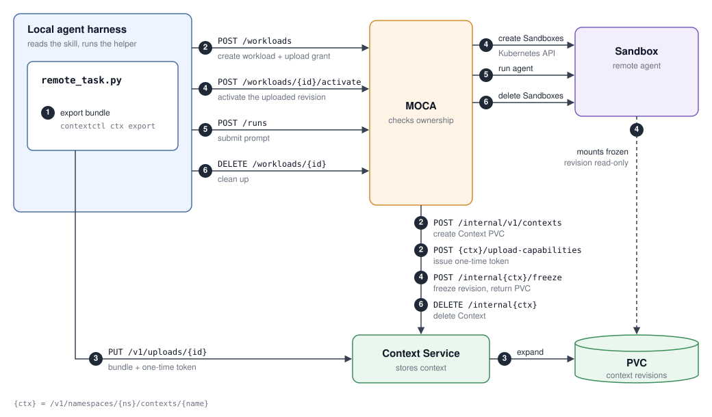

# How context delegation works

The local agent harness reads the `moca-delegate-task` skill and runs its helper,
`scripts/remote_task.py`. The helper packs the selected local context, asks MOCA for
a workload, uploads the context straight to Context Service, and runs the task
remotely. MOCA authorizes every step, but the context bytes never pass through MOCA.

1. **Export**: the helper runs `contextctl ctx export` to pack the selected files into
   a `.context` bundle.
2. **Create**: `POST /workloads`. MOCA calls `POST /v1/sandbox-pools` so Context
   Service provisions the PVC and Sandbox. The helper polls until the workload is ready.
3. **Grant**: `POST /workloads/{id}/uploads`. MOCA checks that the caller owns the
   workload, then calls `POST /v1/sandbox-pools/{id}/uploads`. The response is a
   one-time upload URL and a bearer token that expire after five minutes.
4. **Upload**: `PUT` the bundle to the upload URL with the token. Context Service
   expands it into the PVC. Without step 3 there is no upload URL or token, so the
   upload cannot happen. Context Service rejects any PUT with `401` if its token is
   missing, wrong, expired, or already used.
5. **Run**: `POST /runs` with the workload ID. The remote agent runs in the Sandbox
   with the PVC mounted read-only and reports which context files it used.
6. **Clean up**: `DELETE /workloads/{id}`, unless `--keep-workload` is set. The helper
   records telemetry throughout.

## Fan-out

`batch` uses the same flow with one shared PVC and several Sandboxes. The context is
uploaded once. Each task is then submitted asynchronously as its own session, and the
helper waits for all of them to finish.
